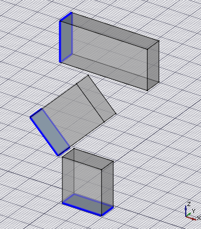
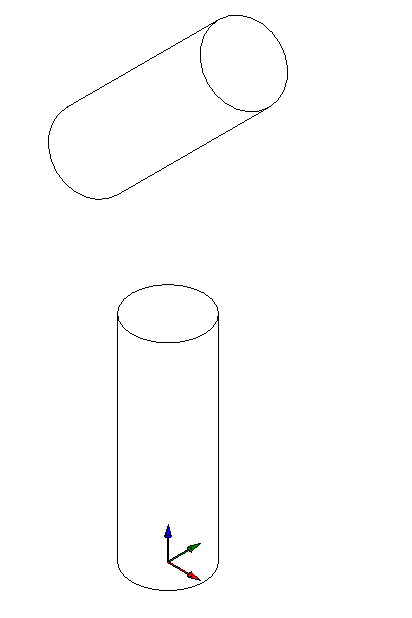
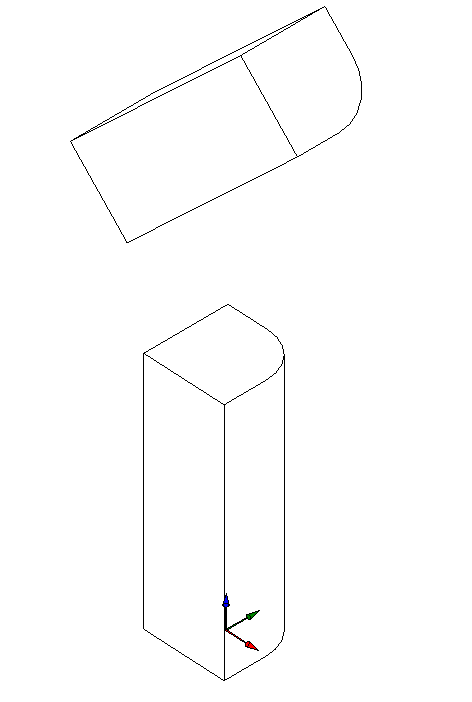
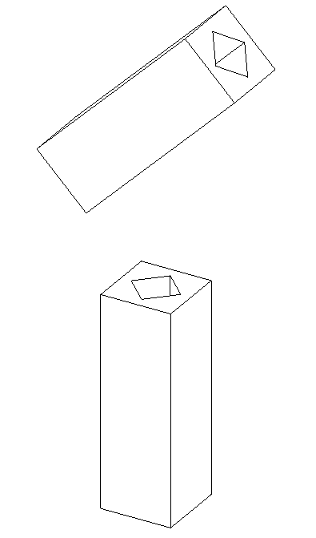
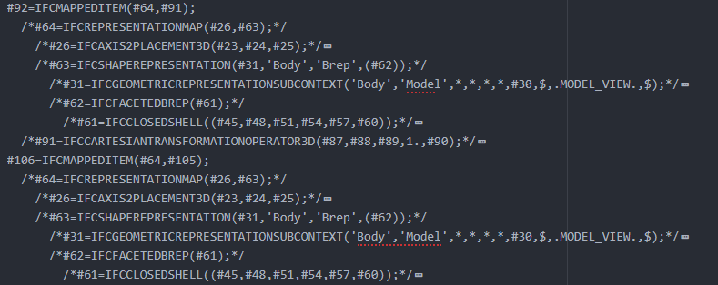
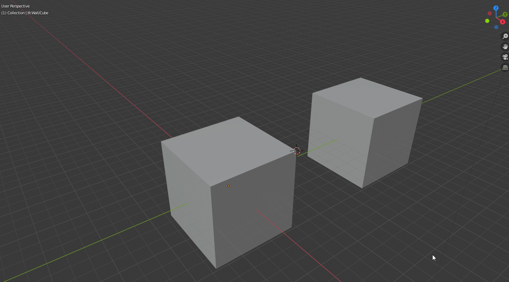
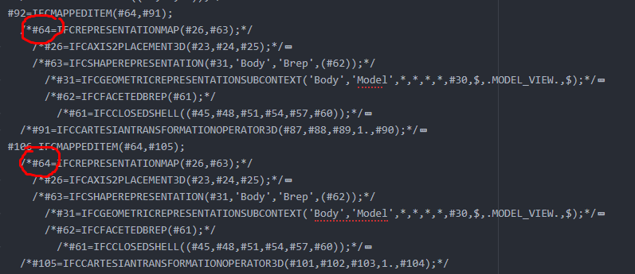
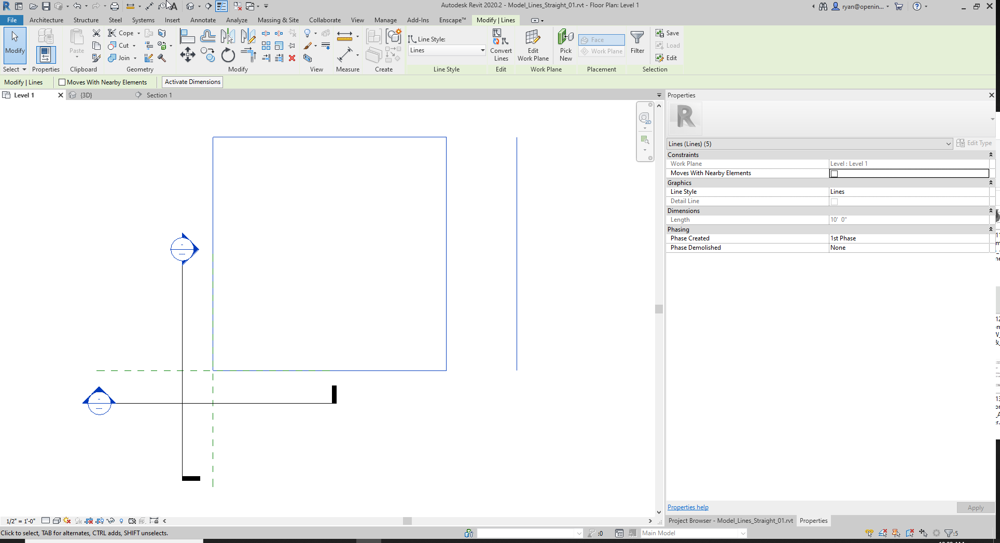

# IFC roundtripping specifications

This file lists "exercises" to be performed by a BIM application to achieve adequate round-tripping with IFC files. The application should successfully complete all the steps.

---

## File Naming Convension Examples:

| 1 – Original File   | 2 – Exported IFC File  | 3 – Imported Native File | 4 – Exported IFC File        | 5 – Imported Native File     |
| ------------------- | ---------------------- | ------------------------ | ---------------------------- | ---------------------------- |
| Extrusions_01.FCStd | Extrusions_02_PASS.ifc | Extrusions_03_PASS.rvt   | Extrusions_04_FAIL_rvt.ifc   | Extrusions_05_FAIL_rvt.rvt   |
|                     |                        |                          |                              | Extrusions_05_FAIL_rvt.FCStd |
|                     |                        | Extrusions_03_PASS.FCStd |                              |                              |
|                     |                        | Extrusions_03_PASS.blend | Extrusions_04_PASS_blend.ifc | Extrusions_05_PASS_blend.rvt |
|                     |                        | Extrusions_03_PASS.pln   | Extrusions_04_PASS_pln.ifc   | Extrusions_05_PASS_pln.pln   |
|                     |                        |                          |                              | Extrusions_05_PASS_pln.rvt   |

---

# Tests

---

## Extrusions_Rectangles

The application should be able to export and import an IFC file containing three IfcBuildingElementProxy entities, each with one representation, which is an IfcExtrudedAreaSolid, each based on IfcArbitraryClosedProfileDef made of an IfcPolyline, like the example below. One profile should lie on the XY plane, one in the YZ plane, and a third on a plane made of one of the former rotated 45° along the Y axis. Extrusion directions should be normal to the profiles.



```
  #20= IFCBUILDINGELEMENTPROXY('0ohBfsArr3ruXYxacT4yl5',#1,'NOTDEFINED',$,$,#2,#21,$,.NOTDEFINED.);
    #21= IFCPRODUCTDEFINITIONSHAPE($,$,(#22));
      #22= IFCSHAPEREPRESENTATION(#9,'Body','SweptSolid',(#23));
        #23= IFCEXTRUDEDAREASOLID(#24,#31,#25,2000.);
          #24 = IFCARBITRARYCLOSEDPROFILEDEF(.AREA., $, #26);
            #26 = IFCPOLYLINE((#27, #28, #29, #30));
              #27 = IFCCARTESIANPOINT((0., 0.));
              #28 = IFCCARTESIANPOINT((1000., 0.));
              #29 = IFCCARTESIANPOINT((1000., 1000.));
              #30 = IFCCARTESIANPOINT((0., 1000.));
          #25= IFCDIRECTION((0.,0.,1.));
          #31= IFCAXIS2PLACEMENT3D(#32,#33,#34);
            #32= IFCDIRECTION((0.7071,0.,-0.7071));
            #33= IFCDIRECTION((0.7071,0.,0.7071));
            #34= IFCCARTESIANPOINT((1000.,0.,2000.));
```

#### Native Funtionality

| Program      | Native funtion/object                                                           |
| ------------ | ------------------------------------------------------------------------------- |
| ArchiCAD     |                                                                                 |
| BlenderBIM   | Mesh - IfcArbitraryClosedProfileDef & ExtrudedDirection saved via Vertex Groups |
| FreeCAD      |                                                                                 |
| Microstation |                                                                                 |
| Revit        | Model-in-Place Family - Solid Extrusion                                         |
| Vectorworks  |                                                                                 |

### Import criteria

* The extrusion directions and profile positions are correct
* The extrusions can be changed after import
* The base polylines can be edited after import

### Export criteria

* The exported IFC file contains three 
  * IfcBuildingElementProxy, each with an 
    * IfcExtrudedAreaSolid as its representation and an 
      * IfcArbitraryClosedProfileDef made of an 
        * IfcPolyline as its profile.

### Results

Test files here: [FreeMVD_WorkFlow/Specifications_Test_Files/Extrusions_Rectangles/](https://gitlab.com/OSarch/FreeMVD_WorkFlow/tree/master/Specifications_Test_Files/Extrusions_Rectangles)

| Program     | Version<br/>native/plugin | Imported Native File  (PASS/FAIL) | Import Comments                                              | Exported IFC File  (PASS/FAIL) | Export Comments                                                                                          |
| ----------- | ------------------------- | --------------------------------- | ------------------------------------------------------------ | ------------------------------ | -------------------------------------------------------------------------------------------------------- |
| ArchiCAD    |                           |                                   |                                                              |                                |                                                                                                          |
| BlenderBIM  | 2.82a/0.200621            | :heavy_check_mark:                | editing the profile's base polylines, however, is cumbersome | :heavy_check_mark:             |                                                                                                          |
| FreeCAD     |                           | :heavy_check_mark:                |                                                              | :heavy_check_mark:             |                                                                                                          |
| Revit       | 2020/20.1.0.1             | :heavy_check_mark:                |                                                              | :x:                            | - Incorrect extrusion direction <br>- IFCARBITRARYCLOSEDPROFILEDEF was changed to IFCRECTANGLEPROFILEDEF |
| Vectorworks |                           |                                   |                                                              |                                |                                                                                                          |

---

## Extrusions_Circles

The application should be able to export and import an IFC file containing 2 circle extrusions.



#### Native Funtionality

| Program      | Native funtion/object                   |
| ------------ | --------------------------------------- |
| ArchiCAD     |                                         |
| BlenderBIM   | Mesh                                    |
| FreeCAD      |                                         |
| Microstation |                                         |
| Revit        | Model-in-Place Family - Solid Extrusion |
| Vectorworks  |                                         |

### Import criteria

* The extrusion directions and profile positions are correct
* The extrusions can be changed after import
* The radius of the circles can be changed after import

### Export criteria

- (2) IFCEXTRUDEDAREASOLIDs with
  - (1) IFCCIRCLEPROFILEDEF

### Results

Test files here: [FreeMVD_WorkFlow/Specifications_Test_Files/Extrusions_Circles](https://gitlab.com/OSarch/FreeMVD_WorkFlow/tree/master/FreeMVD_WorkFlow/Specifications_Test_Files/Extrusions_Circles)

| Program     | Version<br/>native/plugin | Imported Native File  (PASS/FAIL) | Import Comments                      | Exported IFC File  (PASS/FAIL) | Export Comments                                                                       |
| ----------- | ------------------------- | --------------------------------- | ------------------------------------ | ------------------------------ | ------------------------------------------------------------------------------------- |
| ArchiCAD    |                           |                                   |                                      |                                |                                                                                       |
| BlenderBIM  | 2.82a/0.200621            | :x:                               | creates a faceted mesh               | :x:                            |                                                                                       |
| FreeCAD     |                           |                                   |                                      |                                |                                                                                       |
| Revit       |                           | Partial                           | creates (2) arcs instead of a circle | :heavy_check_mark:             | if native file has (2) arcs as the profile, it still exports as  IFCCIRCLEPROFILEDEFs |
| Vectorworks |                           |                                   |                                      |                                |                                                                                       |

## Extrusions_Arcs

The application should be able to export and import an IFC file containing 2 extrusions with arcs in the profile.



#### Native Funtionality

| Program      | Native funtion/object                   |
| ------------ | --------------------------------------- |
| ArchiCAD     |                                         |
| BlenderBIM   |                                         |
| FreeCAD      |                                         |
| Microstation |                                         |
| Revit        | Model-in-Place Family - Solid Extrusion |
| Vectorworks  |                                         |

### Import criteria

* The extrusion directions and profile positions are correct
* The extrusions can be changed after import
* The radius of the arcs can be changed after import

### Export criteria

- IFCEXTRUDEDAREASOLID
  - IFCARBITRARYCLOSEDPROFILEDEF
    - IFCCOMPOSITECURVE
      - (1) IFCCOMPOSITECURVESEGMENT *(the arc)*
        - IFCTRIMMEDCURVE
          - IFCCIRCLE
      - (4) IFCCOMPOSITECURVESEGMENT *(the straight lines)*
        - IFCPOLYLINE

### Results

Test files here: [FreeMVD_WorkFlow/Specifications_Test_Files/Arcs](https://gitlab.com/osarch/FreeMVD_WorkFlow/-/tree/master/Specifications_Test_Files/Extrusions_Arcs)

| Program     | Version<br/>native/plugin | Imported Native File  (PASS/FAIL) | Import Comments        | Exported IFC File  (PASS/FAIL) | Export Comments |
| ----------- | ------------------------- | --------------------------------- | ---------------------- | ------------------------------ | --------------- |
| ArchiCAD    |                           |                                   |                        |                                |                 |
| BlenderBIM  | 2.82a/0.200621            | FAIL                              | creates a faceted mesh | FAIL                           |                 |
| FreeCAD     |                           |                                   |                        |                                |                 |
| Revit       |                           | :heavy_check_mark:                |                        | :heavy_check_mark:             |                 |
| VectorWorks |                           |                                   |                        |                                |                 |

## Extrusions_Void_InnerBoundary



#### Native Funtionality

| Program      | Native funtion/object                   |
| ------------ | --------------------------------------- |
| ArchiCAD     |                                         |
| BlenderBIM   |                                         |
| FreeCAD      |                                         |
| Microstation |                                         |
| Revit        | Model-in-Place Family - Solid Extrusion |
| Vectorworks  |                                         |

### Import criteria

* The extrusion directions and profile positions are correct
* The extrusions can be changed after import
* The base polylines can be edited after import

### Export criteria

- IFCEXTRUDEDAREASOLID
  - IFCARBITRARYPROFILEDEFWITHVOIDS
    - IFCPOLYLINE
      - IFCPOLYLINE       

### Results

Test files here: [FreeMVD_WorkFlow/Specifications_Test_Files/Extrusions_Void_InnerBoundary/](https://gitlab.com/osarch/FreeMVD_WorkFlow/-/tree/master/Specifications_Test_Files/Extrusions_Void_InnerBoundary)

| Program     | Version<br/>native/plugin | Imported Native File (PASS/FAIL) | Import Comments                               | Exported IFC File  (PASS/FAIL) | Export Comments |
| ----------- | ------------------------- | -------------------------------- | --------------------------------------------- | ------------------------------ | --------------- |
| ArchiCAD    |                           |                                  |                                               |                                |                 |
| BlenderBIM  | 2.82a/0.200511            | :x:                              | Profile and Extrusion Direction not available |                                |                 |
| FreeCAD     |                           |                                  |                                               | :heavy_check_mark:             |                 |
| Revit       | 2020/20.1.0.1             | :heavy_check_mark:               |                                               | :heavy_check_mark:             |                 |
| Vectorworks |                           |                                  |                                               |                                |                 |

---

## Mapped Items

Mapped Items, which go by many different names in different BIM apps (a few called out below), are objects where the definition of one object is connected to another.  That is, if one istance is modified, these changes will also be reflected in other connected or linked instances.



#### Native Funtionality

| Program      | Native funtion/object |
| ------------ | --------------------- |
| ArchiCAD     | Objects, Modules      |
| BlenderBIM   | Linked Objects        |
| FreeCAD      | Clones                |
| Microstation | Cells                 |
| Revit        | Groups, Families      |
| Vectorworks  | Symbols               |



### Import criteria

- That the connection or link between objects in still intact.  That is, if one instance is changed, the other instances will change as well.

### Export criteria

- The IFC file has the same shared mapping connected to the objects--circled in red below.



### Results

Test files here: [Specifications_Test_Files/Mapped_Items/](https://gitlab.com/OSarch/FreeMVD_WorkFlow/tree/master/Specifications_Test_Files/Mapped_Items)

| Program     | Version<br/>native/plugin | Imported Native File (PASS/FAIL) | Import Comments                 | Exported IFC File  (PASS/FAIL) | Export Comments |
| ----------- | ------------------------- | -------------------------------- | ------------------------------- | ------------------------------ | --------------- |
| ArchiCAD    |                           |                                  |                                 |                                |                 |
| BlenderBIM  | 2.82a/0.200511            | :heavy_check_mark:               |                                 | :heavy_check_mark:             |                 |
| FreeCAD     |                           | :heavy_check_mark:               |                                 | :heavy_check_mark:             |                 |
| Revit       | 2020/20.1.0.1             | :x:                              | link was broken between objects | :x:                            |                 |
| Vectorworks |                           |                                  |                                 |                                |                 |

---

## Model_Lines_Straight

Straight lines in 3D space.

#### Native Funtionality

| Program      | Native funtion/object |
| ------------ | --------------------- |
| ArchiCAD     |                       |
| BlenderBIM   |                       |
| FreeCAD      |                       |
| Microstation |                       |
| Revit        | Model Lines           |
| Vectorworks  |                       |

### Import criteria



### Export criteria

From Revit...

    /*#160= IFCPRODUCTDEFINITIONSHAPE($,$,(#157));*/
      /*#157= IFCSHAPEREPRESENTATION(#113,'Annotation','Annotation2D',(#147));*/
        /*#113= IFCGEOMETRICREPRESENTATIONSUBCONTEXT($,'Annotation',*,*,*,*,#112,0.01,.PLAN_VIEW.,$);*/
          /*#112= IFCGEOMETRICREPRESENTATIONCONTEXT($,'Annotation',3,0.0001,#101,#102);*/
            /*#101= IFCAXIS2PLACEMENT3D(#6,$,$);*/
              /*#6= IFCCARTESIANPOINT((0.,0.,0.));*/
            /*#102= IFCDIRECTION((6.12303176911189E-17,1.));*/
        /*#147= IFCGEOMETRICCURVESET((#145,#183,#199,#215,#231));*/
          /*#145= IFCPOLYLINE((#9,#143));*/
            /*#9= IFCCARTESIANPOINT((0.,0.));*/

### Results

Test files here: [Model_Lines_Straight](https://gitlab.com/OSarch/FreeMVD_WorkFlow/tree/master/Specifications_Test_Files/Model_Lines_Straight)

| Program     | Version<br/>native/plugin | Imported Native File (PASS/FAIL) | Import Comments | Exported IFC File  (PASS/FAIL) | Export Comments |
| ----------- | ------------------------- | -------------------------------- | --------------- | ------------------------------ | --------------- |
| ArchiCAD    |                           |                                  |                 |                                |                 |
| BlenderBIM  |                           |                                  |                 |                                |                 |
| FreeCAD     |                           |                                  |                 |                                |                 |
| Revit       | 2020/20.1.0.1             | :heavy_check_mark:               |                 | :heavy_check_mark:             |                 |
| Vectorworks |                           |                                  |                 |                                |                 |

<!--

## Category

Short Description


#### Native Funtionality

| Program      | Native funtion/object |
| ------------ | --------------------- |
| ArchiCAD     |                       |
| BlenderBIM   |                       |
| FreeCAD      |                       |
| Microstation |                       |
| Revit        |                       |
| Vectorworks  |                       |

### Import criteria

- Description of what needs to be seen in the native app

### Export criteria

Something similar to this...

- IFCEXTRUDEDAREASOLID
  - IFCARBITRARYPROFILEDEFWITHVOIDS
    - IFCPOLYLINE
      - IFCPOLYLINE  

### Results

Test files here: [name of test](https://gitlab.com/OSarch/FreeMVD_WorkFlow/tree/master/Specifications_Test_Files/location of test files)

| Program     | Version<br/>native/plugin | Imported Native File (PASS/FAIL) | Import Comments | Exported IFC File  (PASS/FAIL) | Export Comments |
| ----------- | ------------------------- | -------------------------------- | --------------- | ------------------------------ | --------------- |
| ArchiCAD    |                           |                                  |                 |                                |                 |
| BlenderBIM  |                           |                                  |                 |                                |                 |
| FreeCAD     |                           |                                  |                 |                                |                 |
| Revit       |                           |                                  |                 |                                |                 |
| Vectorworks |                           |                                  |                 |                                |                 |

-->